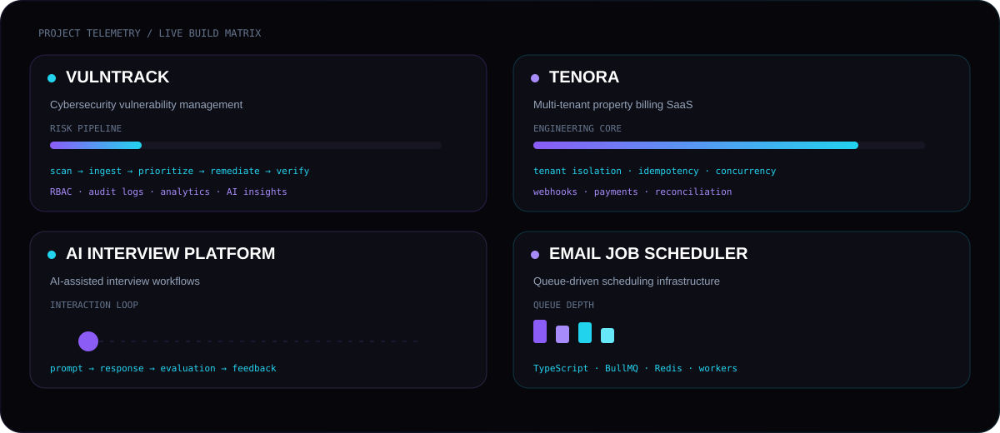
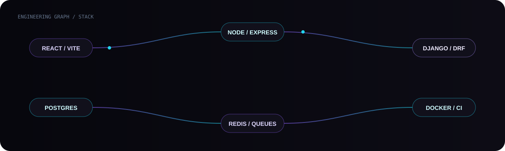
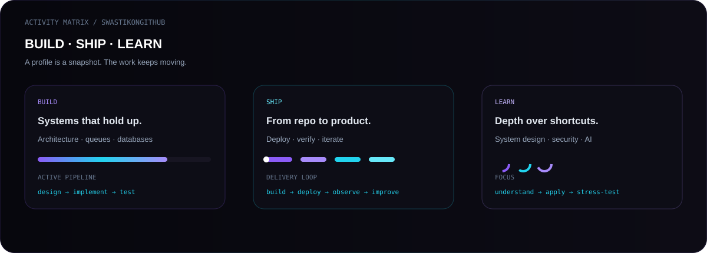
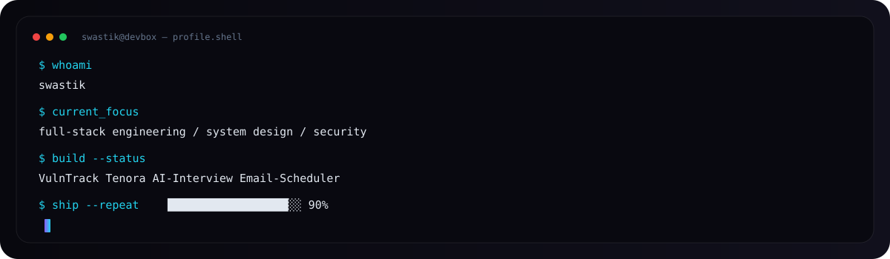

<div align="center">



<br/>

<a href="https://linkedin.com/in/swastiksin/"></a>
<a href="https://portfolio-swastik-singh.vercel.app/"></a>
<a href="mailto:swastiksingh288@gmail.com"></a>

<br/><br/>


</div>

---

## `01 / IDENTITY`

I’m **Swastik Singh**, a Computer Science Engineering student and full-stack developer building systems that are meant to survive real usage, not just screenshots.

My current engineering interests sit around:

```text
FULL-STACK APPLICATIONS
SYSTEM DESIGN
BACKEND ARCHITECTURE
SECURITY
AI-ASSISTED PRODUCTS
ASYNC / QUEUE-DRIVEN SYSTEMS
```

---

## `02 / PROJECT TELEMETRY`

<div align="center">



</div>

---

## `03 / ENGINEERING STACK`

<div align="center">



<br/><br/>


</div>

---

## `04 / ACTIVITY MATRIX`

<div align="center">



<br/><br/>


</div>

---

## `05 / TERMINAL`

<div align="center">



</div>

---

## `06 / HOW I BUILD`

```text
problem
   ↓
requirements
   ↓
architecture
   ↓
implementation
   ↓
tests
   ↓
failure handling
   ↓
deployment
   ↓
iteration
```

The goal isn't to make a repository look impressive.

The goal is to make the engineering hold up when the happy path disappears.

---

## `07 / CONNECT`

<div align="center">

<a href="https://portfolio-swastik-singh.vercel.app/"><strong>PORTFOLIO</strong></a>
&nbsp; · &nbsp;
<a href="https://linkedin.com/in/swastiksin/"><strong>LINKEDIN</strong></a>
&nbsp; · &nbsp;
<a href="mailto:swastiksingh288@gmail.com"><strong>EMAIL</strong></a>

<br/><br/>

<sub>Built as a living developer profile. The visuals are part of the product.</sub>

</div>
