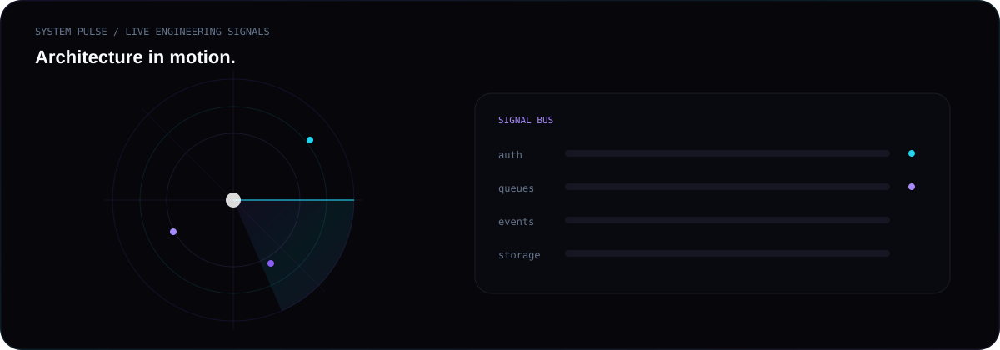
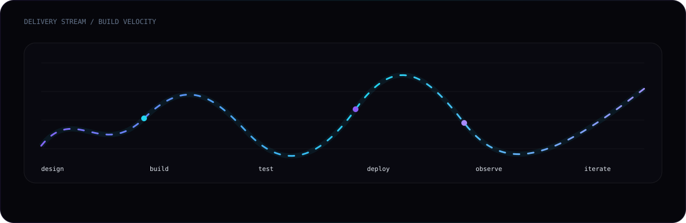
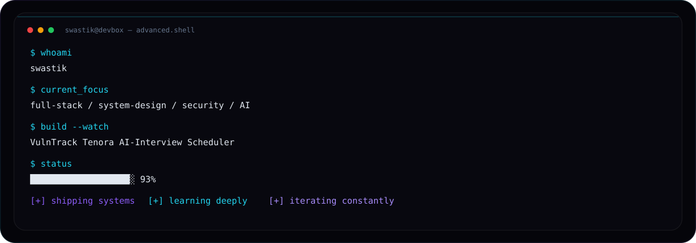

<div align="center">



<br/>

<a href="https://linkedin.com/in/swastiksin/"></a>
<a href="https://portfolio-swastik-singh.vercel.app/"></a>
<a href="mailto:swastiksingh288@gmail.com"></a>

<br/><br/>


</div>

---

## `01 / IDENTITY`

I’m **Swastik Singh**, a Computer Science Engineering student and full-stack developer building systems that are meant to survive real usage, not just screenshots.

```text
FULL-STACK APPLICATIONS  ·  SYSTEM DESIGN  ·  SECURITY
AI-ASSISTED PRODUCTS     ·  ASYNC SYSTEMS  ·  PRODUCT ENGINEERING
```

---

## `02 / SYSTEM PULSE`

<div align="center">



</div>

---

## `03 / PROJECT TELEMETRY`

<div align="center">


</div>

---

## `04 / ENGINEERING GRAPH`

<div align="center">


<br/><br/>


</div>

---

## `05 / DELIVERY STREAM`

<div align="center">



</div>

---

## `06 / ACTIVITY MATRIX`

<div align="center">


<br/><br/>


</div>

---

## `07 / TERMINAL`

<div align="center">



</div>

---

## `08 / HOW I BUILD`

```text
problem
   ↓
requirements
   ↓
architecture
   ↓
implementation
   ↓
tests
   ↓
failure handling
   ↓
deployment
   ↓
iteration
```

The goal isn't to make a repository look impressive.

The goal is to make the engineering hold up when the happy path disappears.

---

## `09 / CONNECT`

<div align="center">

<a href="https://portfolio-swastik-singh.vercel.app/"><strong>PORTFOLIO</strong></a>
&nbsp; · &nbsp;
<a href="https://linkedin.com/in/swastiksin/"><strong>LINKEDIN</strong></a>
&nbsp; · &nbsp;
<a href="mailto:swastiksingh288@gmail.com"><strong>EMAIL</strong></a>

<br/><br/>

<sub>Motion, systems, and code — all living inside a GitHub profile.</sub>

</div>
